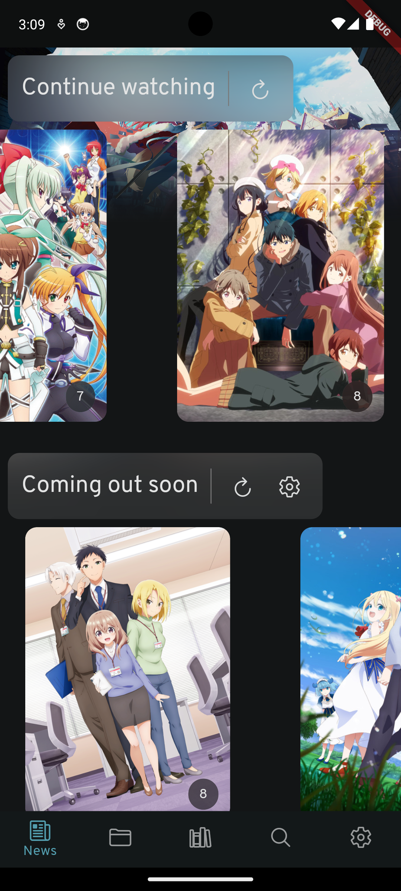

<h1 align="center">Anikki</h1>

<p align="center">
  
  
   
</p>


> Anikki is currently being developped as a hobby of mine and many things are subject to change.

## Features

* Netflix-like "Continue watching" for everything you are watching
* Stream (almost) any anime using torrent or hosted videos
* Automatic anime watch list tracking. No need to know which episode was the last one you saw anymore.
* Browse local anime files with Anilist information
* Check what animes are coming out in the next few days (Yes, Korean and Hentais are included if you want to)
* Browse your watch list and watch anything from there
* Download or play (almost) any anime on the fly
* Embedded player (with [media_kit](https://github.com/alexmercerind/media_kit))
* Search for any torrent on [nyaa.si](https://nyaa.si)
* Search for any anime, staff or character information
* Remote torrent client connection for [Transmission](https://transmissionbt.com) and [QBitTorrent](https://www.qbittorrent.org) (Only on landscape mode for now)
  * QBitTorrent is recommended for a smoother streaming experience.
* More to come?

## Building

1. Install [Flutter](https://flutter.dev) for you platform
2. Clone this repo 

```bash
git clone --recursive https://github.com/Kylart/Anikki 

cd Anikki
cp .env.example .env

flutter build <platform>
```

## Develop

```bash
flutter run
```

###  To re-generate Anilist schema and classes
You will need [nodejs](https://nodejs.org) installed.

```bash
# Generate Anilist types
cd scripts
npm install && npm run gen:schema

cd ..
dart run build_runner build

# (Optional) If you want to work on the Anilist types
dart run build_runner watch
```

### Run tests

#### Unit tests
```bash
flutter test
```

#### Integration tests
> Very limited for now
```bash
flutter test integration_test
```

### Architecture
This project is implementing the architecture described by the [BloC library](https://bloclibrary.dev/#/architecture) for now.

## Contributing
Any contribution is appreciated.

1. Fork it!
2. Create your feature branch: git checkout -b my-new-feature
3. Commit your changes: git commit -am 'Add some feature'
4. Push to the branch: git push origin my-new-feature
5. Submit a pull request.

## License
MIT License

Copyright © 2022 & onwards, Kylart <kylart.dev@gmail.com>